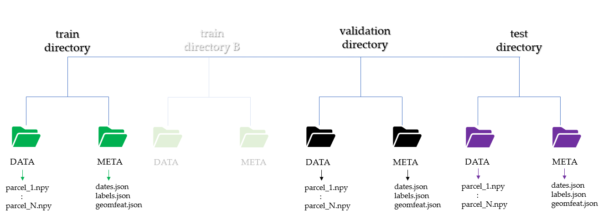
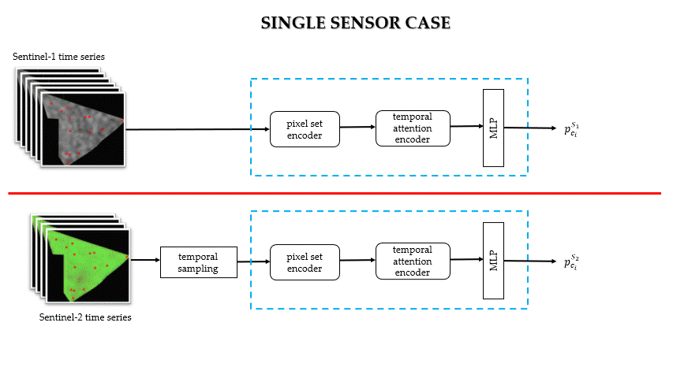

# Crop type mapping from optical and radar time series using attention-based deep learning
This code extents the pytorch implementation of the [PSE-TSA](https://github.com/VSainteuf/pytorch-psetae) deep learning architecture to accomodate different forms of multi-sensor fusion. 

## Requirements
- pytorch + torchnet
- numpy + pandas + sklearn + seaborn

## Satellite data preparation
* follow the guideline [here](https://github.com/ellaampy/GEE-to-NPY) to download normalized parcel-level Sentinel-1 & 2 time series (independently) from Google Earth Engine
* otherwise, prepare parcel-level time series of shape (```T x C x N ```) where;
    * T --> number of acquisitions
    * C --> number of channels/bands
    * N --> number of pixels within parcel
* run ```data_preparation/min_temp_seq.py``` to decide a minimum sampling size. Relevant for cases where area of interest is covered by multiple satellite footprints,  and metadata cloud filtering may result in varying time series length
* organize time series array into separate folders from training, validation and testing

## Folder structure
The root folder should contain Sentinel-1 and Sentinel-2 directory named ```s1_data ``` and ```s2_data ```. Their sub-directories must be similar to the structure in the figure below


## Crop type labels 
Reference data ([Registre parcellaire graphique (RPG)](https://www.data.gouv.fr/fr/datasets/registre-parcellaire-graphique-rpg-contours-des-parcelles-et-ilots-culturaux-et-leur-groupe-de-cultures-majoritaire/)) is obtained from French open data [platform](data.gouv.fr). A total of 20 agricultural land use are distributed within the study area, Finistère. The following steps are applied to derive analysis ready crop type labels;
* ignore labels containing mixed classes (except for ```other cereals``` to allow the mapping of buckwheat)
* discard classes with < 0.02% of the total reference data
* merge temporal and permanent meadows 

In the end, 12 classes are retained namely; 
```[maize, wheat, barley, rapeseed, protein crops, gel (frozen surfaces), fodder, pasture and moor, meadows, orchards, vegetables/flowers and other cereals]```

Their corresponding labels are provided as a list of sub-classes in ```single_sensor/dataset.py``` and ```multi_sensor/dataset.py```to be considered for classification.


## Running main experiments
```python

# single sensor (Sentinel-1)
train.py --dataset_folder /s1_data/Quimper --val_folder /s1_data/Morlaix --test_folder /s1_data/Brest --epochs 100 --rdm_seed 1 --sensor S1 --input_dim 2 --mlp1 [2,32,64] --num_classes 12 --minimum_sampling 27 --res_dir /output_dir

# multi-sensor (early fusion)
train_fusion.py --dataset_folder /s1_data/Quimper --val_folder /s1_data/Morlaix --test_folder /s1_data/Brest --fusion_type early --minimum_sampling 27 --interpolate_method nn --epochs 100 --rdm_seed 1 --input_dim 2 --mlp1 [2,32,64] --num_classes 12 --res_dir /output_dir

"""
for multi-sensor, Sentinel-1 data directory (s1_data) is modified as (s2_data) in the dataset.py script to load Sentinel-2 data. Additionally, input_dim and mlp1-4 are handled within multi_sensor/models/stclassifier_fusion.py
"""
```

Types of fusion



## Results
Quantitative results from single and multi-sensor experiments are available in the `results` folder/ 

## Credits
* This research relies heavily on the [paper](https://arxiv.org/pdf/1911.07757.pdf) "Satellite Image Time Series Classification with Pixel-Set Encoders and Temporal Self-Attention" by Saint Fare Garnot et al., 2019.
* The label data originates from [Registre parcellaire graphique (RPG)](https://www.data.gouv.fr/fr/datasets/registre-parcellaire-graphique-rpg-contours-des-parcelles-et-ilots-culturaux-et-leur-groupe-de-cultures-majoritaire/) of the French National Geographic Institute (IGN)


## Reference
Please cite the following paper if you use any part of the code

```
citation goes here
```

## Contributors
 - Stella Ofori-Ampofo
 - [Dr. Charlotte Pelletier](https://sites.google.com/site/charpelletier)
 - [Dr. Stefan Lang](https://scholar.google.com/citations?user=e0X2Y0gAAAAJ&hl=en)